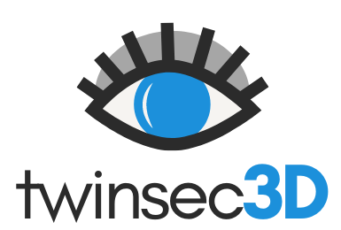

<!-- PROJECT SHIELDS -->
[![Contributors][contributors-shield]][contributors-url]
[![Forks][forks-shield]][forks-url]
[![Stargazers][stars-shield]][stars-url]
[![Issues][issues-shield]][issues-url]

<!-- PROJECT LOGO -->
<br />
<div align="center">
  <a href="https://github.com/TWINSEC3D/simulation">
    
  </a>

  <h1 align="center">TwinSec3D Simulation</h1>

  <p align="center">
    An advanced warehouse simulation project using Docker containers and Wazuh SIEM platform.
  </p   >
</div>

<!-- ABOUT THE PROJECT -->
## About The Project

[![Product Name Screen Shot][product-screenshot]](https://example.com)

This project provides the source code for a car seat warehouse simulation. It is based on Docker container technology and serves as a cybersecurity testbed using the Wazuh SIEM platform. Each simulation container is individually monitored by a Wazuh agent.

### Built With

* [Docker](https://www.docker.com/)
* [Wazuh](https://wazuh.com/)
* [PostgreSQL](https://www.postgresql.org/)


<!-- GETTING STARTED -->
## Getting Started

To get a local copy up and running follow these simple steps.

### Prerequisites

Ensure you have Docker and Docker Compose installed on your system.

* Docker
  ```sh
  sudo apt-get install docker-ce docker-ce-cli containerd.io
  ```

* Docker Compose
  ```sh
  sudo curl -L "https://github.com/docker/compose/releases/download/1.29.2/docker-compose-$(uname -s)-$(uname -m)" -o /usr/local/bin/docker-compose
  sudo chmod +x /usr/local/bin/docker-compose
  ```

### Installation

1. Clone the repository
   ```sh
   git clone https://github.com/TWINSEC3D/simulation.git
   ```
2. Navigate to the project directory
   ```sh
   cd simulation
   ```
3. Create and configure the `.env` file with your values
   ```env
   INDEXER_URL=https://wazuh.indexer:9200
   INDEXER_USERNAME=admin
   INDEXER_PASSWORD=SecretPassword
   FILEBEAT_SSL_VERIFICATION_MODE=full
   SSL_CERTIFICATE_AUTHORITIES=/etc/ssl/root-ca.pem
   SSL_CERTIFICATE=/etc/ssl/filebeat.pem
   SSL_KEY=/etc/ssl/filebeat.key
   API_USERNAME=wazuh-wui
   API_PASSWORD=MyS3cr37P450r.*-
   OPENSEARCH_JAVA_OPTS=-Xms512m -Xmx512m
   DASHBOARD_USERNAME=kibanaserver
   DASHBOARD_PASSWORD=kibanaserver
   ```
4. Start the Docker containers
   ```sh
   docker-compose up -d
   ```

<!-- USAGE EXAMPLES -->
## Usage

Use this project as a cybersecurity testbed and to simulate a warehouse environment. Additional examples and screenshots can be added to illustrate how the simulation works and how to interact with it.

<!-- ROADMAP -->
## Roadmap

See the [open issues](https://github.com/TWINSEC3D/simulation/issues) for a full list of proposed features (and known issues).

<!-- CONTRIBUTING -->
## Contributing

Contributions are what make the open-source community such an amazing place to learn, inspire, and create. Any contributions you make are **greatly appreciated**.

If you have a suggestion that would make this better, please fork the repo and create a pull request. You can also simply open an issue with the tag "enhancement".

Don't forget to give the project a star! Thanks again!

1. Fork the Project
2. Create your Feature Branch (`git checkout -b feature/AmazingFeature`)
3. Commit your Changes (`git commit -m 'Add some AmazingFeature'`)
4. Push to the Branch (`git push origin feature/AmazingFeature`)
5. Open a Pull Request

<!-- CONTACT -->
## Contact

* Magdalena Glas - [magdalena.glas@ur.de](mailto:magdalena.glas@ur.de) - University of Regensburg
* Johannes Rackl - [johannes.rackl@stud.uni-regensburg.de](mailto:johannes.rackl@stud.uni-regensburg.de) - University of Regensburg
* Philip Empl - [philip.empl@ur.de](mailto:philip.empl@ur.de) - University of Regensburg


## Citation

If you use this project in your research, please cite our paper:

```bibtex
@inproceedings{Glas2024,
  author    = {Magdalena Glas and Johannes Rackl and Philip Empl and Günther Pernul},
  title     = {Asset-Centric OT Security Analytics with Digital Twins},
  booktitle = {Submitted to: Proceedings of the 10th IEEE European Symposium on Security and Privacy (EuroS&P 2025)},
  year      = {2025},
  location  = {Vienna, Austria},
  date      = {t.b.a}
}
```

<!-- MARKDOWN LINKS & IMAGES -->
[contributors-shield]: https://img.shields.io/github/contributors/TWINSEC3D/simulation.svg?style=for-the-badge
[contributors-url]: https://github.com/TWINSEC3D/simulation/graphs/contributors
[forks-shield]: https://img.shields.io/github/forks/TWINSEC3D/simulation.svg?style=for-the-badge
[forks-url]: https://github.com/TWINSEC3D/simulation/network/members
[stars-shield]: https://img.shields.io/github/stars/TWINSEC3D/simulation.svg?style=for-the-badge
[stars-url]: https://github.com/TWINSEC3D/simulation/stargazers
[issues-shield]: https://img.shields.io/github/issues/TWINSEC3D/simulation.svg?style=for-the-badge
[issues-url]: https://github.com/TWINSEC3D/simulation/issues


